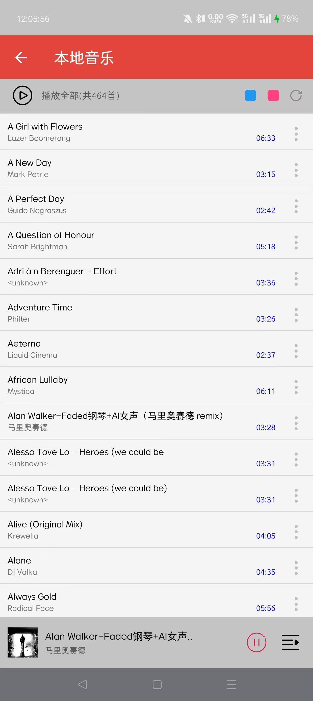

# SimpleMusic
代码来自：
https://github.com/ikunjee/SimpleMusic

## 1. 开发环境
- Android Studio Bumblebee | 2021.1.1 RC 1
- AndroidSDK 34
- gradle 7.2

## 2. 增加功能
- 1 本地音乐显示时长，可以按照时长和名称排序（点一次正排，再点一次倒排）  √
- 2 界面最下方没有考虑虚拟键的存在，和虚拟键重合了 √
- 3 直接进入本地音乐，如果没有音乐就扫描 √
- 4 加定时停止 X
- 5 列表改动后，存储的列表同步修改 √
- 6 图标按下变色 √
- 7 排序第二次点反向排序 √
- 8 蓝牙控制 √
- 9 耳机拔出后暂停 √
- 10 常驻后台不被杀掉，添加菜单栏 √
- 11 每首音乐用自己的图标 √
- 12 点音乐图标弹框显示音乐路径 √

